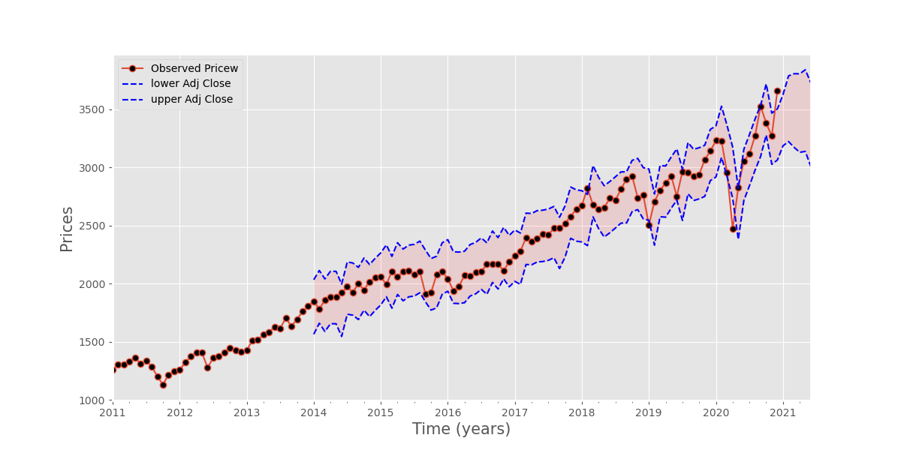

# PredictingTheSP500

## In this volatile year is the stock market a safe bet?
#### Where to put your money with COVID-19 on the loose.  

### Use Time Series Analysis of historical prices for the SP500 Index to perdict the next 6 months of prices.
##### Scrape/Import Historical Data
* SP500 - 10 years - daily prices
* SP500 component stocks for (Kernel-PCA)

# Initial EDA

  
##### Annual Returns Are Concentrated near 0

              
##### Spike in recent volatility

##### CandleStick Plot
* green = closing price > open price
* red = closing price < open price

# Kernel-PCA
### Use z-score to normalize data
#### Perform on Component Stocks within the SP500 Index
##### Outputs:
* EigenVectors - direction of principal component line 
    - does not change during linear transformation
* EigenValues - amount of variance of data in direction with respect to particular eigenvector

 

### Reconstruct Kernel-PCA vs SP500 Index (Price)
  

# Stationary Time Series Data
* Price movements tend to drift towards some long term mean either upwards or downwards.
* Stationary TS has constant mean/variance/autocorrelation over time
* Must do this or potential for Spurious Regression  misleading statistical evidence of relationships between independent non stationary variables

                    

      

 ### Augmented Dicker-Fuller Test
 ##### Null = time series contains unit root and is non-stationary
 * p-value > 0.05 = reject null (nonstationary)
 ##### Alternative - time series does not contain unit root and is stationary
 * p-value ≤ 0.05 = fail to reject null (stationary)
 

# ARIMA & SARIMAX
### Fit by Grid Search to find lowest AIC
### Fit data to Model

 

   

# PREDICTION:
   
   
* Upper & Lower Bounds of Fitted Parameters (7 year Rolling Perdictions - Trailing)
* 95% Confidence Interval (shaded Section)
* Forcast 6 months into future
    - perdiction widens to reflect loss of certainty in the market outlook

# SUMMARY:
##### Time Series Analysis of Historic Prices for the S&P500 Index
* 10 year, daily prices
##### Kernel PCA Dimension Reduction Technique within component stocks in S&P500 Index
* keep mose useful components
* simplify porfolio analysis (computational time, space, and complexity)
##### Statistical Time Series Analysis to obtain Stationary Time Series
* trends, seasonality, presece of unit root, combination
* unit root can lead to a 'random walk/drift' within the Time Series
##### Statistic Tests - Augmented Dicker Fulley (ADF)
* conduct hypothesis test determine if expectations are met or violated
 * p-value ≤ 0.05 = critical values >>> fail to reject null (stationary)
 * adf-statistic = negative and goal is to be lower than critical values

# LOOKING FORWARD:
* Precision Model Comparison
* Generate portfolio from components of SP500
* Build Automated Trading Model to Trade based on Perdictions/Moving Averages
